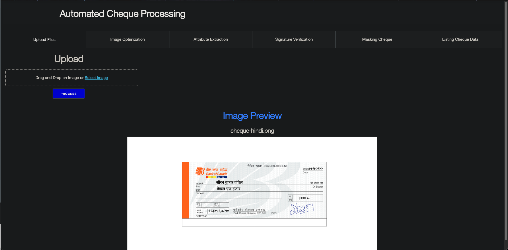
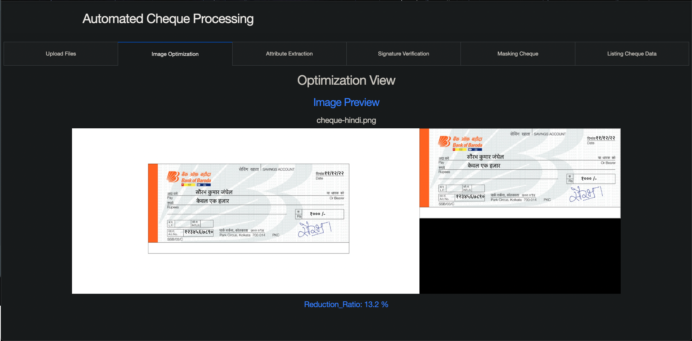
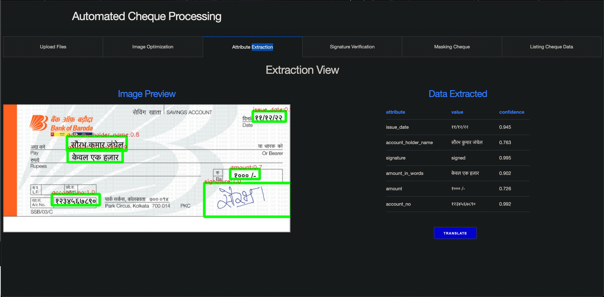
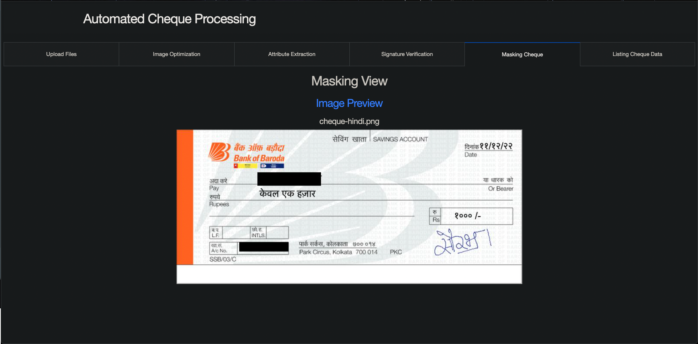
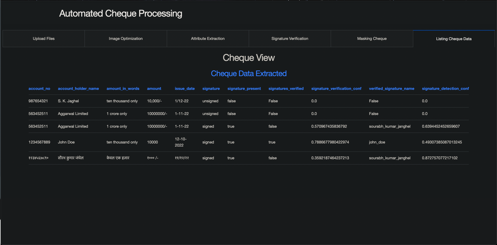

# [BOB - automate-cheque-processing](https://www.techgig.com/hackathon/automate-cheque-processing)

## Objective
```
Bank handles large volumes of cheques in the clearing process. The process involves many technical verifications including signature verification. Some of these steps are manual and require human intervention to complete the process. The current process requires the high human capital deployment and longer processing time.

Solution Expected:
Using rule-based and AI/ML/ICR/ OCR (Optical Character Recognition) capabilities for automation and doing technical and signature verification of the cheques.
- Automation of the clearing process using AI/ML/ICR/OCR techniques
- Automatic Data Entry & Technical verification
- Signature Verification
- Support Multilingual
- Reduce Human Efforts
- Reduce Processing time
- Detecting Potential Frauds
```

## Solution Proposed (POC)
```
The idea is to use the following:

- Cognitive Services to extract text from the cheque(Computer Vision OCR):
- Processor Models trained to extract required entities (Form Recognizer)
- AI services to extract NERs,detect language, translate if needed, key-value extraction
- Azure Functions for parallel processing and scaling
- Custom model to extract signatures from documents

The FLow of Processing:

1. The flow starts with reading documents from edge devices and publishing them on the azure blob for processing.
2. Once a new document is uploaded (synchronized) in Azure Blob Storage, it shall be immediately processed.
3. Azure Blob storage has a trigger that executes a simple Azure function that sends the message to Azure Queue
4. Azure Queue has a trigger that executes an advanced Azure function that 
    1) retrieves documents from a blob storage account
    2) extract required entities by calling other services attached 
    3) detect and verify signatures
    4) translation service
    5) masking results
    6) writes results to an Azure cosmos database
5) one can connect this to Web App to see results of everything provided with this solution
```

## Solution Architecture


## Solution Video Demonstration Can be found [here](https://drive.google.com/file/d/1gRcZK0jRq_GusskbYgupXoLXdZ-89Jcg/view?usp=share_link)

## Solution Samples
### UPLOADING


### OPTIMIZATION


### EXTARCTION


### TRANSLATION


### MASKING


### DATA VIEW

